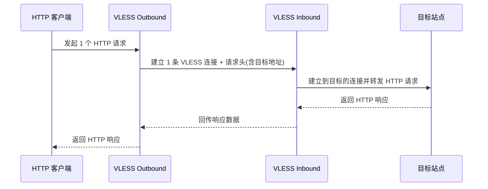
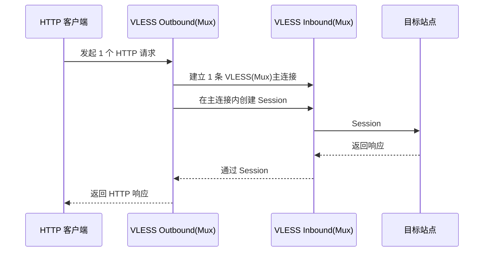
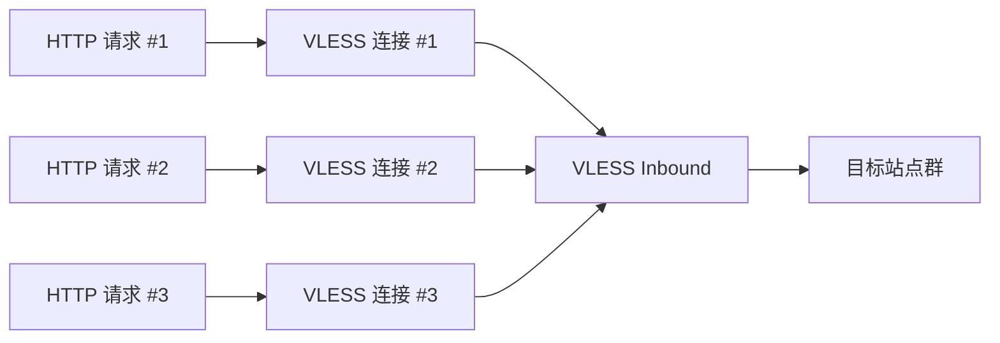
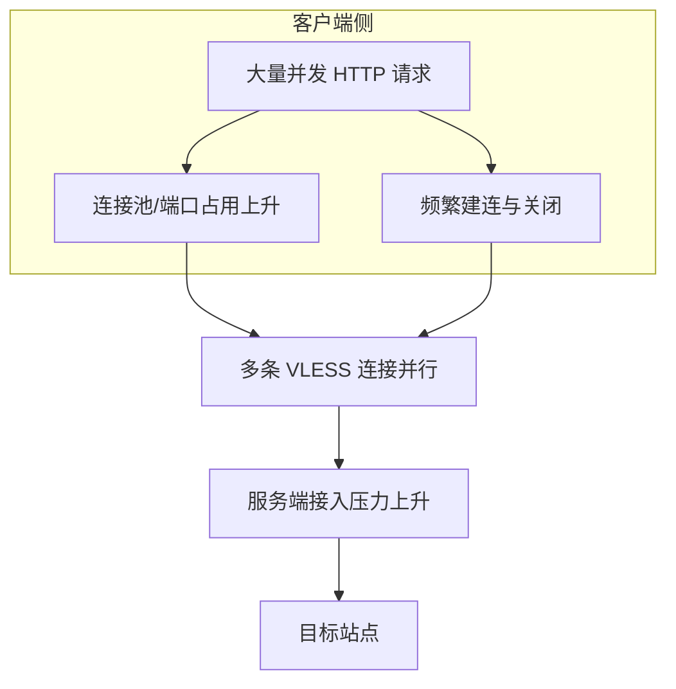
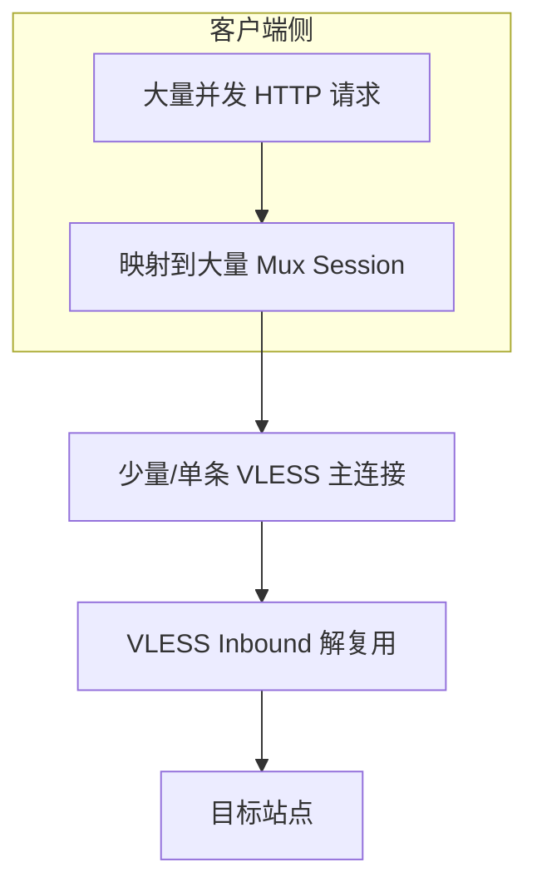

# VLESS 与 VLESS+Mux 下 HTTP 请求交互示意（中文）

本文用 Mermaid 图说明 3 类场景在 VLESS 与 VLESS+Mux 中的端到端交互差异：

1. 单个普通 HTTP 请求
2. 多个 HTTP 请求（低并发）
3. 高并发 HTTP 请求

> 说明：这里的 HTTP 请求可来自浏览器、curl 或上游代理。VLESS 是传输与隧道层，不改变 HTTP 语义；Mux 影响的是“多个上层连接如何复用到底层连接”。

---

## 1) 单个普通 HTTP 请求

### 1.1 VLESS（不启用 Mux）



要点：通常是“1 个上层连接 ≈ 1 条底层 VLESS 传输通道”。

### 1.2 VLESS + Mux



要点：单请求下也可工作，但 Mux 优势不明显；主要收益在多请求场景。

---

## 2) 多个 HTTP 请求（低并发，例如连续打开多个页面资源）

### 2.1 VLESS（不启用 Mux）



要点：多个请求往往对应多条底层连接，握手与连接管理开销随请求数增加。

### 2.2 VLESS + Mux

```mermaid
flowchart LR
    A[HTTP 请求 #1] --> S1[Session #1]
    C[HTTP 请求 #2] --> S2[Session #2]
    D[HTTP 请求 #3] --> S3[Session #3]

    subgraph M[同一条 VLESS 主连接]
      S1
      S2
      S3
    end

    M --> E[VLESS Inbound(Mux 解复用)]
    E --> F[目标站点群]
```

要点：多个请求复用同一条 VLESS 主连接，减少频繁建连成本。

---

## 3) 高并发 HTTP 请求（例如突发大量短请求）

### 3.1 VLESS（不启用 Mux）



典型表现：
- 连接数增长快，资源占用更高（socket、端口、上下文切换）
- RTT 较高或网络抖动时，建连开销更明显

### 3.2 VLESS + Mux



典型表现：
- 底层连接数显著减少，建连放大效应降低
- 并发主要体现在 Session 调度与服务端转发能力上

> 注意：Mux 不是“无限增益”。在极高并发下，瓶颈可能转移到单连接队头阻塞、服务端 CPU、目标站点响应能力等。

---

## 实践建议（简版）

- **单请求、低频请求**：VLESS 与 VLESS+Mux 体验差异通常不大。
- **多请求、短连接、跨高 RTT 链路**：VLESS+Mux 通常更有优势。
- **高并发**：建议压测观察端到端指标（RTT、吞吐、P95/P99、连接数、CPU），再决定 Mux 并发策略。

## 与实现代码的对应（便于继续深入）

- VLESS 请求/响应头编解码：`proxy/vless/encoding/encoding.go`
- VLESS 入口/出口处理：`proxy/vless/inbound/inbound.go`、`proxy/vless/outbound/outbound.go`
- Mux 帧格式与会话：`common/mux/frame.go`、`common/mux/session.go`
